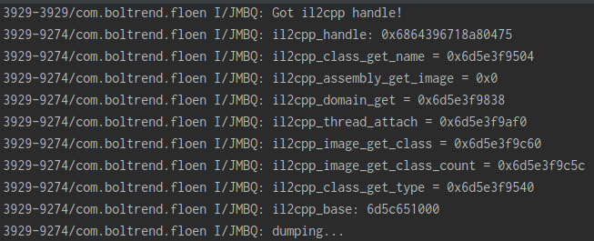
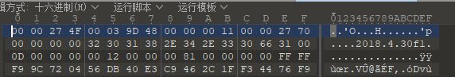
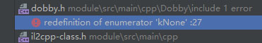
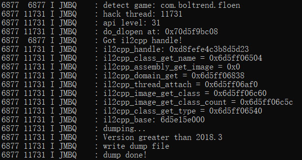

日期：2022/11/19

# 前言
  同样是issues里发现的手游，但dump中途会闪退，你值得被我征服
    
# 过程
  将包名写进il2cppdumper项目，flashandRebootRelease，发现游戏基本会在 dumping... 后闪退  
  
  纳尼，难道你也是坏孩子？我又从裤裆里摸出shamiko，发现没啥用
  
  推断在```LOGI("dumping...");```的某个api出问题了，那就一并打印测试
  ```
  init_il2cpp_api();
    if (il2cpp_domain_get_assemblies) {
        LOGI("il2cpp_class_get_name = %p", il2cpp_class_get_name);
        LOGI("il2cpp_assembly_get_image = %p", il2cpp_assembly_get_image);
        LOGI("il2cpp_domain_get = %p", il2cpp_domain_get);
        LOGI("il2cpp_thread_attach = %p", il2cpp_thread_attach);
        LOGI("il2cpp_image_get_class = %p", il2cpp_image_get_class);
        LOGI("il2cpp_image_get_class_count = %p", il2cpp_image_get_class_count);
        LOGI("il2cpp_class_get_type = %p", il2cpp_class_get_type);
        Dl_info dlInfo;
        if (dladdr((void *) il2cpp_domain_get_assemblies, &dlInfo)) {
            il2cpp_base = reinterpret_cast<uint64_t>(dlInfo.dli_fbase);
        } else {
            LOGW("dladdr error, using get_module_base.");
            il2cpp_base = get_module_base("libil2cpp.so");
        }
        LOGI("il2cpp_base: %" PRIx64"", il2cpp_base);
    }
  ```
  
    
  从图中可以看到il2cpp_assembly_get_image这个api有问题，但感觉并不是api隐藏的问题，才消失一个，就不动用ida了，另寻它法看能不能绕过

  从apk中提取assets\bin\Data\globalgamemanagers，丢进010editer查看，unity版本是2018.4.30f1
     
  
    
  打开我祖传的unity，找到2018.4.30f1，看看il2cpp_assembly_get_image这个api都干了啥  
```
// assembly
const Il2CppImage* il2cpp_assembly_get_image(const Il2CppAssembly *assembly)
{
    return Assembly::GetImage(assembly);
}
```
继续追  
```
Il2CppImage* Assembly::GetImage(const Il2CppAssembly* assembly)
{
    return assembly->image;
}
```
很清楚了，api直接获取assembly指针里的image，那我们一样画葫芦  

```auto image = il2cpp_assembly_get_image(assemblies[i]);```  修改成  
 ```auto image = assemblies[i]->image;```

代码瞬间报错，提示没有image这玩意，那你肯定没把对应2018.4.30f1的il2cpp-api-functions.h和il2cpp-class.h替换进项目中

替换完毕之后，代码又开始报错```auto items = reflectionTypes->vector;```  
指针没有vector，没事，这个是绝对不会执行到的流程，因为unity大于2018.3，所以直接注释掉与它相关的报错内容

继续打包，又跳出一个错误  
  
```
Dobby.h
typedef enum {
  kMemoryOperationSuccess,
  kMemoryOperationError,
  kNotSupportAllocateExecutableMemory,
  kNotEnough,
  kNone
} MemoryOperationError;

il2cpp-class.h
typedef enum Il2CppMetadataTypeFlags
{
    kNone = 0,
    kValueType = 1 << 0,
    kArray = 1 << 1,
    kArrayRankMask = 0xFFFF0000
} Il2CppMetadataTypeFlags;
```
kNone重复了，那就修改dobby这个，改成 kNone_ ，之后就顺利打包了

  

# 结果
感觉是这个unity版本的问题，并非手游开发人员修改，以后看到这个版本unity注意一下就行
