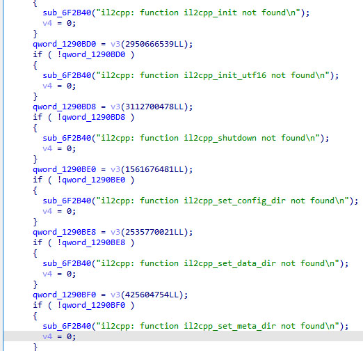
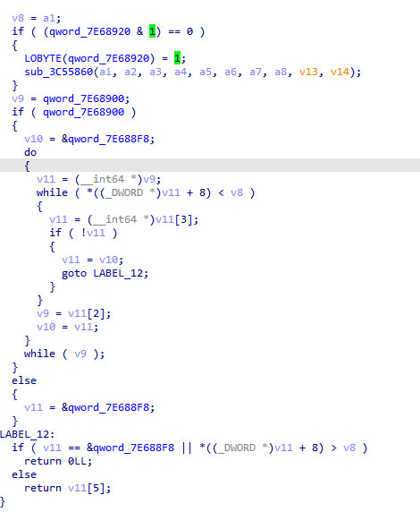
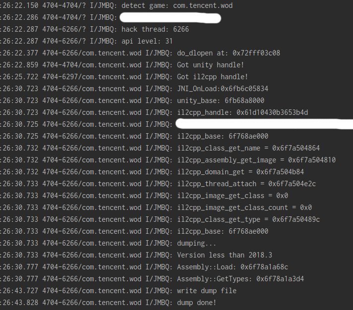

# 前言
  这家伙的API藏的很深，头疼
<br>
<br>
<br>

  
# 流程
  和手游《月圆之夜》一样，搜索il2cpp_method_get_class，顺利定位到方法<br>
  <br><br>
  一看很眼熟，API名称字符串都出现了，但它和《月圆之夜》不同，它不是通过API名称来定位的，而是使用一串奇怪的数字做参数来定位API<br>
<br>
  v3(1561676481LL)，这个v3是动态生成，可以捕捉获取，定位于libil2cpp.so内<br>
<br>
  libil2cpp.so是加密的，要去内存中dump出解密的libil2cpp.so，丢进IDA<br>
  <br>
  v3的F5图如下<br>
  <br>
  <br>参数个数明显对不上，只能暴力弄它，开工
  <br>
```
    //部分丑陋的代码,纯体力活，没办法优雅
    il2cpp_method_get_param_count = (uint32_t (*)(const MethodInfo * method)) sub(0x2537EBDA);
    il2cpp_method_get_param = (const Il2CppType* (*)(const MethodInfo * method, uint32_t index)) sub(0x79788A52);
    il2cpp_method_get_param_name = (const char* (*)(const MethodInfo * method, uint32_t index)) sub(0xD29AE232);
    il2cpp_method_get_flags = (uint32_t (*)(const MethodInfo * method, uint32_t * iflags)) sub(0x78C955EE);
    il2cpp_method_get_return_type = (const Il2CppType* (*)(const MethodInfo * method)) sub(0x41D41CC2);
    il2cpp_property_get_name = (const char* (*)(PropertyInfo * prop)) sub(0x932215A6);
    il2cpp_property_get_get_method = (const MethodInfo* (*)(PropertyInfo * prop)) sub(0xB91FC865);
    il2cpp_property_get_set_method = (const MethodInfo* (*)(PropertyInfo * prop)) sub(0xE99E95F1);
    il2cpp_domain_get_assemblies = (const Il2CppAssembly** (*)(const Il2CppDomain * domain, size_t * size)) sub(0xB793E260);
    il2cpp_domain_get = (Il2CppDomain* (*)()) sub(0x216577B9);
    il2cpp_thread_attach = (Il2CppThread* (*)(Il2CppDomain * domain)) sub(0x83CAAF0E);
    il2cpp_assembly_get_image = (const Il2CppImage* (*)(const Il2CppAssembly * assembly)) sub(0x1FD7BE43);
    il2cpp_get_corlib = (const Il2CppImage* (*)()) sub(0x6E9EBF5C);
    il2cpp_image_get_name = (const char* (*)(const Il2CppImage * image)) sub(0x27083DE4);
    il2cpp_string_new = (Il2CppString* (*)(const char* str)) sub(0xB4B87982);
    il2cpp_thread_detach = (void (*)(Il2CppThread * thread)) sub(0x89BAB962);
```
<br>
附上最终结果图<br><br>

<br><br>

# 最后
虽然dump出来了，但没有丝毫愉悦感，反而有种挫败感，没能完整分析它的关键方法。
