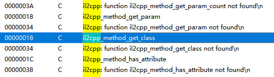
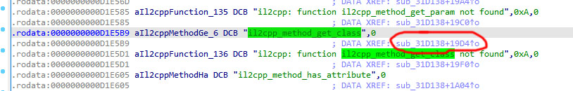
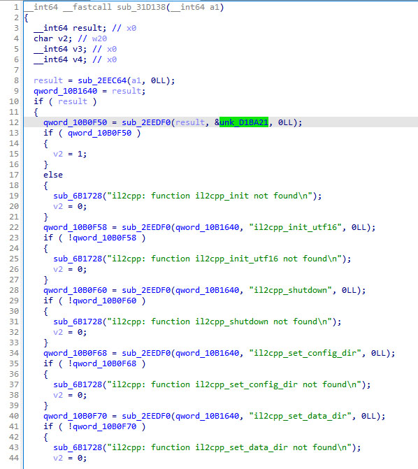
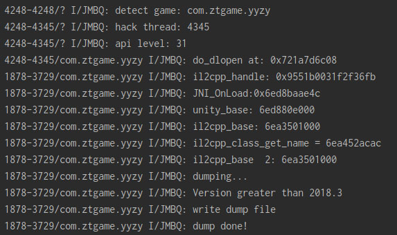

# 前言
日期：2022/11/18  
说起来，我还是从P大的il2cppdumper里面的issues了解到月圆之夜的  
经过一番研究，发现这个游戏隐藏了几乎所有的il2cpp的api，这也就导致了il2cppdumper失败  

# 思路
il2cpp相关的api是需要unity调用的，既然被隐藏了，那么libunity.so必然有对应的解法  
  
~~打开手游，闪退，好了，本教程到此结束~~
  
它检测到root直接闪退，看来你学坏了呀，shamiko，我一边喊一边掏出我裤裆里的40米长刀直接就是一顿爆砍，完事  
  
ida载入libunity.so， shift+F12弹出字符串窗口，搜索“il2cpp”，出现一大堆结果，双击il2cpp_method_get_class  
  
  
    
找到这个sub_31D138，然后F5，当时差点没笑出声来，你们这么直白真的好么

    
很明显，这个sub_2EEDF0是获取API的关键函数，开刀直接hook它，打印的结果确实验证了我的想法

sub_2EEDF0代替了dlsym来查找il2cpp的api，那我们剩下要做事情不是很清楚了吗，当然是抓它来主动调用，从而获取dump.cs

# 代码
```
<hook.cpp>
void *unity_handle = nullptr;

void dlopen_process(const char *name, void *handle) {
    //LOGD("dlopen: %s", name);
    if (!il2cpp_handle) {
        if (strstr(name, "libil2cpp.so")) {
            il2cpp_handle = handle;
            LOGI("Got il2cpp handle!");
        } else if (strstr(name, "libunity.so")) {
            unity_handle = handle;
            LOGI("Got unity handle!");
        }
    }
}

```
  
```
<il2cpp_dump.cpp>
extern void *unity_handle;
uint64_t unity_base = 0;

void init_il2cpp_api() {
    auto sub = (void *(*)(void *a1, const char *a2, void *a3)) (unity_base + 0x2EEDF0);
//#define DO_API(r, n, p) n = (r (*) p)dlsym(il2cpp_handle, #n)
  #define DO_API(r, n, p) n = (r (*) p)sub(unity_handle, #n, nullptr)
  #include "il2cpp-api-functions.h"
  #undef DO_API
}

void il2cpp_dump(void *handle, char *outDir) {
    //initialize
    LOGI("il2cpp_handle: %p", handle);
    il2cpp_handle = handle;
  
    //先把libunity.so的基址找出来，我被get_module_base坑过几次，得到的基址有时候是错的，怕了怕了，还是dladdr最稳
    void *jni_handle = dlsym(unity_handle, "JNI_OnLoad");
    if (jni_handle) {
        LOGI("unity JNI_OnLoad:%p", jni_handle);
        Dl_info dlInfo;
        if (dladdr(jni_handle, &dlInfo)) {
            unity_base = reinterpret_cast<uint64_t>(dlInfo.dli_fbase);
        }
    }
    LOGI("unity_base: %" PRIx64"", unity_base);

    init_il2cpp_api();
    ...//以下内容完全相同，故省略
}

```

# 结果
  
  
  
